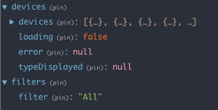

# Kaluza device list SPA exercise

This project was bootstrapped with [Create React App](https://github.com/facebook/create-react-app).

## How to run this

The backend server provided by Kaluza team must be up and running. The service providing the device info must be available at [http://localhost:8080/devices/](http://localhost:8080/devices/)

Once this repo has been cloned, run the script:
### `npm install`
To install all required dependencies and then:

### `npm start`

Runs the app in the development mode. 
Open [http://localhost:3000](http://localhost:3000) to view it in the browser.

The page will reload if you make edits. 
You will also see any lint errors in the console.

## What I have used

In order to implement this MVP as a single page application I have worked with this stack:

### React
I have written components with functional style when using stateless components and ES6 classes when building stateful components.
### Redux
Used to manage the app state. In this case we are storing the following info in the store:
- deviceList: an array with all info related to devices
- loading: boolean flag to know if the info is being loaded
- error: in case there's an error fetching the devices store the error
- typeDisplayed: the current device type that is being displayed in the list. In case is `null` all device types will be displayed.
- filter: the value of current filter used for the device status. Values could be `All`,`Online`,`Offline`

### Styled Components
Used to style the spa.
### Other dependencies used
#### Redux-thunk
Used to make asynchronous requests in the action creators
#### MomentJs
Used to work with dates in JS
#### Styled Normalize
Used to normalize browsers default styles with styled components

## Folder structure
Because it's a very simple application I haven't used a very fancy folder structure.
#### `index.js`
This is the entry point of our React App
#### `App.js`
Here is where our app is initialized
#### `config.js`
Here we store information used to configure our application that can be dependant on the evironment (dev, test, prod). API urls, API keys, Formats, languages,...
#### `store.js`
Here we create the redux store and load any middleware used.
#### `pages`
Here we store components that wrap a whole page, in this case we only have one `DeviceListPage`.
#### `components`
As mentioned before because it's a small app we could store all components used here. For a larger app this won't be very scalable because it will grow and won't be easy to handle the large list of components. A different approach should be used for a larger app like [fractal](https://hackernoon.com/fractal-a-react-app-structure-for-infinite-scale-4dab943092af) or similar.
#### `state`
Here is where we manage the redux state. I have used `ducks` file structure to organise action names, action creators and reducers. [Duck files structure](https://medium.com/@scbarrus/the-ducks-file-structure-for-redux-d63c41b7035c)
#### `static`
Here we store all static files needed, images, videos, .... (in this case, just a couple of images stolen from Kaluza site :-) )
#### `styles`
Here we store the style component theme, global styles and everything related to styling that is reused across the app

## Suggesting further improvements
I was not sure if these should be part of the MVP, because of time constraints I decided not to include them and just leave some notes here about them.
####`Make the app Responsive`
It was not mentioned in the exercise description so I decided to make this work for desktop resolutions. In "real life" the should be displayed correctly in mobile devices.
####`Loading spinner while fetching devices`
This should be nice, I have left the boolean flag implemented in the redux state. So the idea is that while the flag `loading` is true render a loading spinner, otherwise try to render the device list. It was not worth it because the loading time is very fast since we are fetching from our local server.
####`Creating and empty state when there are no devices returned`
This should be creating a nice message saying there are no devices to display
