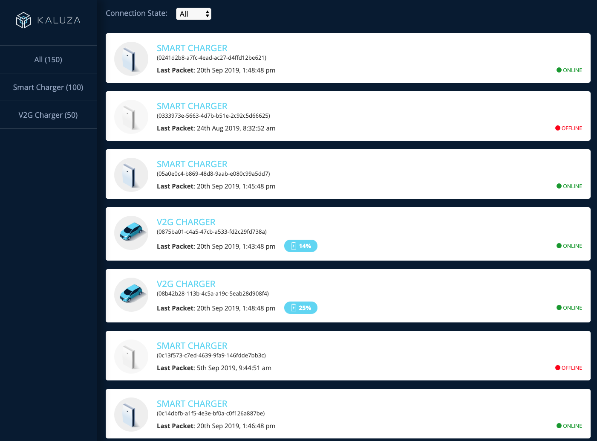

# Kaluza device list SPA exercise

This project was bootstrapped with [Create React App](https://github.com/facebook/create-react-app).

## How to run this

The backend server provided by Kaluza team must be up and running. The service providing the device info must be available at [http://localhost:8080/devices/](http://localhost:8080/devices/)

Once this repo has been cloned, run the script:

### `npm start`

Runs the app in the development mode. 
Open [http://localhost:3000](http://localhost:3000) to view it in the browser.

The page will reload if you make edits. 
You will also see any lint errors in the console.

## What I have used

In order to implement this MVP as a single page application I have worked with this stack:

### React
### Redux
Used to manage the app state. In this case we are storing the following info in the store:
- deviceList: an array with all info related to devices
- loading: boolean flag to know if the info is being loaded
- error: in case there's an error fetching the devices store the error
- typeDisplayed: the current device type that is being displayed in the list. In case is `null` all device types will be displayed.
- filter: the value of current filter used for the device status. Values could be `All`,`Online`,`Offline`

### Styled Components
### Other dependencies used
#### Redux-thunk
#### MomentJs
#### Styled Normalize

## Folder structure
